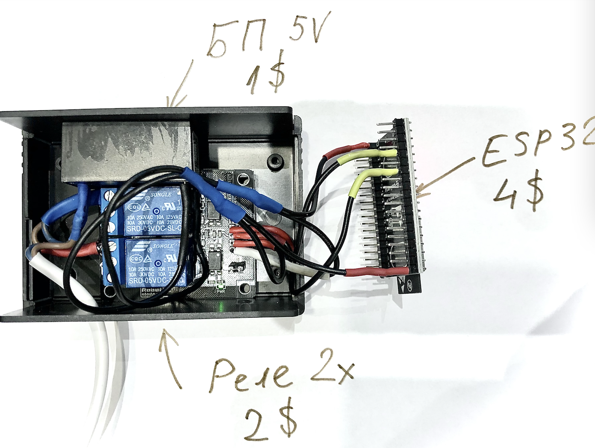
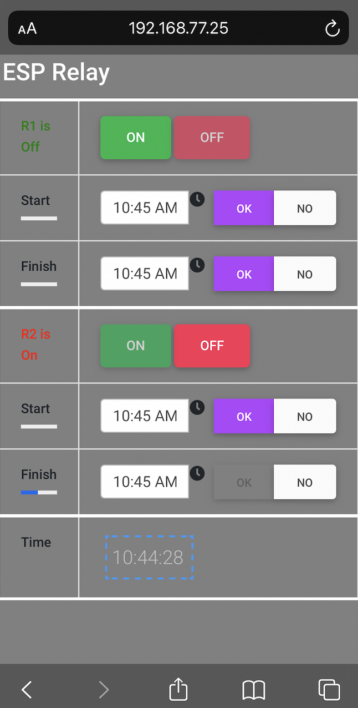

# Универсальный ESP

Собрав достаточно самоделок на ESP и Arduino платах (некоторые лежат здесь в соседних репозиториях), включая:

- термостат для террариумов
- погодную станцию
- клон Гайвер-лампы
- 4WD робота 
- итд,

мы столкнулись с повторением в каждом из проектов типичных вещей. А именно, функций, необходимых пожалуй для любого IoT проекта. Поэтому мы решили создать шаблон, который позволит нам (и Вам) быстро настроить минимально необходимый набор инструментов для превращения голой платы в рабочую лошадку.

Для воплощения  шаблона мы взяли простой, но столь полезный проект - реле на основе ESP модуля. Оба варианта подойдут:

- ESP8266 - https://ru.wikipedia.org/wiki/ESP8266
- ESP32 - https://ru.wikipedia.org/wiki/ESP32

Мы закупили большой запас таких устройств на Ali (одно устройство по цене хот-дога), и задача состояла в том, чтобы штамповать на их основе проекты (смарт-релешки) с минимальными усилиями.

Под смарт-реле мы понимаем то, что к определенным разъемам плат ESP будут подключены реальные реле для управления нагрузкой, например:

- https://robotdyn.com/relay-module-1-relay-5v.html

Ваша задача - разъемами или паяльником подключить проводки от реле к правильным ножкам ESP (масса обучалок Вам в помощь) и записать на склеротичке ряд цифр - к какой ножке (GPIO) подключено каждое реле.

Все дальнейшее должно стать простым, как угол дома.

В качестве реле минимальной стоимости подойдет и это:

- модуль на одно реле - https://arduino.ua/prod2582-modyl-rele-dlya-esp-01esp-01s-v4
- плюс ESP-01 для него

Плата уже подключена на заводе к GPIO0. На наш взгляд, это - самая дешевая, но не самая тупая смарт-розетка (конечно, добавьте корпус и БП на 5В).

Но для чего-то покруче, можете взять несколько любых совместимых реле и подключить их ко множеству подходящих GPIO. Вы получите мега-реле без проблем.

  

С механической частью мы закончили. А что дальше?
Возникает вопрос, какие же минимальные функции Вам нужны почти в любом подобном проекте.

Вот они:

- возможность подключиться к новому Wi-Fi, куда бы Вас не занесло без перепрограммирования
- предоставление устройством интерфейса для настройки такого беспроводного подключения
- внутренний WEB сервер (портал устройства), который встречает Вас, если Вы зайдете в браузере на его страничку (введете IP устройства) 
- API для того, чтобы включить или выключить реле вручную или по расписанию из браузера или интернет устройств
- так как само устройство не является часами, то время оно должно получать с сервера NTP
- устройство должно быть многопользовательским
- любой пользователь должен видеть на WEB страничке устройства его актуальное состояние, то есть, какие реле и расписания подключены или выключены
- устройство способно принимать и отправлять сообщения на сервер MQTT с целью полноценной интеграции в Smart-Home и IoT систему (1)
- устройство может само получать и отправлять информацию, используя API сетевых устройств, например отправлять/получать данные с REST-сервисов, например загружать прогноз погоды для своих целей
- наконец, устройство должно в последующем обновляться "по воздуху" (2).

## Комментарии:
1. Мы боремся за минимальную цену и сложность устройства. Если не обвешивать ESP плату, то сама она не может быть мега-мозгом Вашего дома. Поэтому, создавать на ней сложные расписания на неделю (для теплиц, коттеджей итп.) или сложную логику не стоит. Правильный путь - сложные расписания должно храниться в интеграторе, управляющем всем Smart-Home и передающем задачи "своре" устройств через MQTT брокера. В такой системе возможно по взмаху дирижера (интегратора) своей дирижерской палочкой (MQTT) играть на всех устройствах симфонию рассвета: включая чайники, музыку, поднимая шторы и прогревая авто ранним утром...

2. Первую заливку программы в плату Вы конечно делаете по проводам, но затем, смонтировав и подключив устройство Вы получите возможность обновлять прошивку по WiFi

И вот, получился наш небольшой проект (пока-лишь тестовая версия). Благодаря которому Вы сможете собрав устройство:

- скачать себе данный архив программы (скетча для заливки а плату)
- применить незначительные настройки, указав, в частности:
   - Имя устройства (используется для коммуникаций)
   - Пароль к обновлению "по воздуху" (aka "OTA")
   - Число и список пинов (GPIO), к которым Вы подключили реле (одно или много)
  - NTP сервер и Ваш часовой пояс (TIMESHIFT в секундах)
  - Адрес MQTT сервера (все это в файле settings.h)
  - Количество реле (в HTML файле index.html.h)

### settings.h
<pre>
#define DEVNAME "MishRelay"
#define OTAPAS "admin"
#define PINS_NUM 2
#define PINS_AR {5,4}
#define NTPSERV "europe.pool.ntp.org"
#define TIMESHIFT 7200
#define MQTTSERV "192.168.77.30"
</pre>

### index.html.h
<pre>
/*
NUMBERS OF RELAYS
*/
var NumRelays=2;
</pre>
 

## Итог

Собственно и все. Выбирайте в Arduino IDE опции заливки программы (следуя обучалкам, например, от уважаемого А.Гайвера https://alexgyver.ru/lessons/arduino-ide/) и загружайте ее по проводам в плату (только в этот раз). 

Не отключая проводов проверьте работу. Для этого загляните в доступные сети WiFi с телефона (например). Там появится имя Вашего устройства. Соединившись с ним, как с роутером, Вы "упадете" в страничку конфигурации подключений. В ней Вы настроите Ваше устройство для работы домашней сетью WiFi. Подробности на странице используемой нами библиотеки: https://github.com/khoih-prog/ESPAsync_WiFiManager
 

После этого устройство должно нормально соединиться с Вашим домашним интернетом и в Arduino IDE (монитор порта) Вам придут строки текста о предоставленном ему IP.

Заходите по этому IP на страничку устройства и видите, что-то подобное:

  

Это - элементарный собственный WEB-портал устройства и минималистичные функции расписаний. Так как более подвинутые и логически обусловленные действия лучше реализовать в интеграторе, как мы и советовали. Масса зрелых проектов в помощь:

- https://www.home-assistant.io
- https://www.openhab.org 

Располагайте Ваше устройство в нужном месте. Функция обновления по воздуху позволит апгрейдить его когда будет нужно, без демонтажа. Подробности на страничке используемой нами библиотеки https://github.com/jandrassy/ArduinoOTA.

При надлежащем опыте новое устройство (приехавшее с Ali) за 15 минут превращается в готовое многофункциональное реле для умного дома. Напомним, что кроме механических функций (вкл/выкл) устройство может доставать и отправлять в интернет информацию, например, путем REST запросов. Мы оставили эту возможность в виде helper-класса ReqestSHelper. Тут уж Вам придется допрограммировать самостоятельно, так как мы не в курсе  Ваших желаний. Вы можете, например, получать из сети информацию о времени рассвета и Ваше реле может реагировать в зависимости от этого. Подобные примеры есть других наших проектах. 

А вот поддержка MQTT включена сразу без усилий для Вас. Реле после соединения с MQTT сервером начнет информировании другие IoT-устройства о своем состоянии и получать от брокера MQTT (мы пользуемся https://mosquitto.org) команды включения-выключения. Если данная функция Вам не нужна, просто закомментируйте строку <i>#include "MQTT.h"</i> (файл Pattern_ESP.ino). Но если все оставить, как есть, то:

- при старте нового устройства Вы, одновременно с настройкой пароля к WiFi, можете указать ip адрес MQTT сервера
- если этого не сделать, то поддержка MQTT будет выключена
- если соединение с брокером MQTT установится, Ваше реле будет посылать сообщения о включении/выключении в тему "erelay1"
- устройство подписывается на тему "erelay2" и реагирует на сообщения в формате "n=on" / "n=off" (где n-номер реле) включая и выключая n-ое реле 
- названия тем, как и другие настройки соединения находятся в файле settings.h 

## ВНИМАНИЕ!
Если Вы хотите сбросить настройки и обнулиться, чтобы при старте заново открылся конфигурационный портал, то просто нажмите на reset кнопку на плате ESP два раза с паузой не менее 2 и не более 20секунд. После этого реле снова заработает, как WiFi сеть, подключившись к которой Вы попадете на страничку конфигурации и тд.
##

##
## ИТАК
- мы получили "жирное  реле", в котором остались еще ресурсы для прочих задач (типа опроса датчиков)
- реле синхронизировано с точным временем по сети
- реле управляется со смартфона (вообще любого браузера)
- оно может управляется по сети REST запросами (можно натянуть любое web-лицо)
- устройство само публикует свое состояние в MQTT брокере и подписано на публикацию управляющих команд, то есть реле может управляться другими IoT устройствами
- настройка соединения с WiFi выполняется интуитивно просто и может быть сброшена кнопкой без перепрошивки
- если все же нужна перепрошивка ПО, то оно выполняется "по воздуху" без отключения устройства
##

Желаем нашему реле развиваться и размножаться

